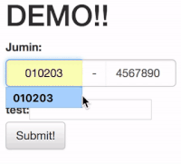

# django-jumin => django-korean-fields 로 진화중
Django용 주민등록번호 필드 &amp; 위젯

#### 기능
- 주민번호 유효성 검사
- 날자 유효성 검사(윤년 검사 포함)
- 붙여 넣기 적당히 잘되게
- 앞뒤 주민번호 이동
- 앞자리 다쓰고 나서 고칠 때 짜증나게 자꾸 뒷자리로 날라가지 않음
- 그 외 앵간한거 그냥 다 됨

#### Demo


#### Example

example 폴더 참조

## 의존성
- Twitter bootstrap 3
- jQuery
- Django (2.0+만 테스트)
- django-bootstrap-form 사용하면 좋음(안해도되고...)

## 사용법
INSTALL_APPS에 'jumin'추가

``` python
INSTALLED_APPS = [
    'jumin',
    
    ...
    'my_app',
    ...
    
    'django.contrib.admin
```

## model에서 사용 시 
```python
from django.db import models
from jumin.fields import JuminField

class YourEverythingModel(models.Model):

    name = models.CharField(u'실명', max_length=20)
    
    jumin = JuminField(u'내 주민번호')
    mom_jumin = JuminField(u'엄마 주민번호')
    dad_jumin = JuminField(u'아빠 주민번호')
    uncle_jumin = JuminField(u'삼촌 주민번호')
    
    your_secret = models.TextField(u'비밀정보')
    ...
```    

## form에서 사용 시
```python
class TestForm(forms.Form):
    jumin = JuminFormField()
    another = CharField(label='test', max_length=10, required=False)
```

